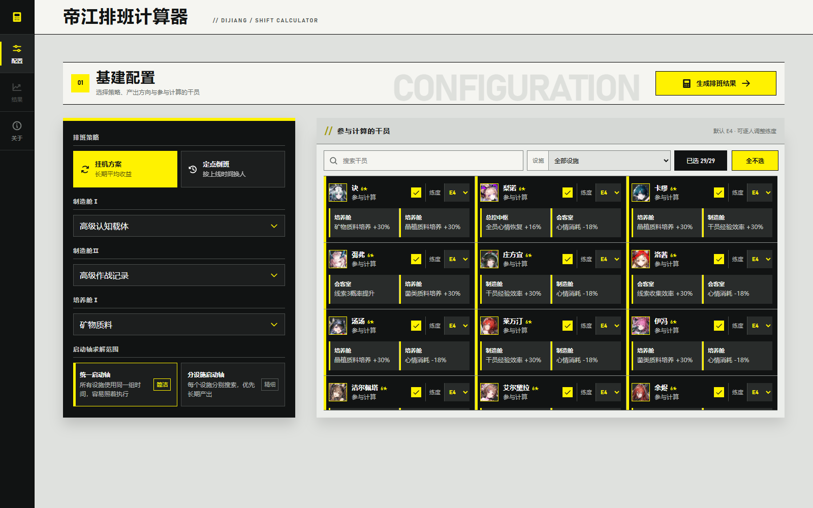
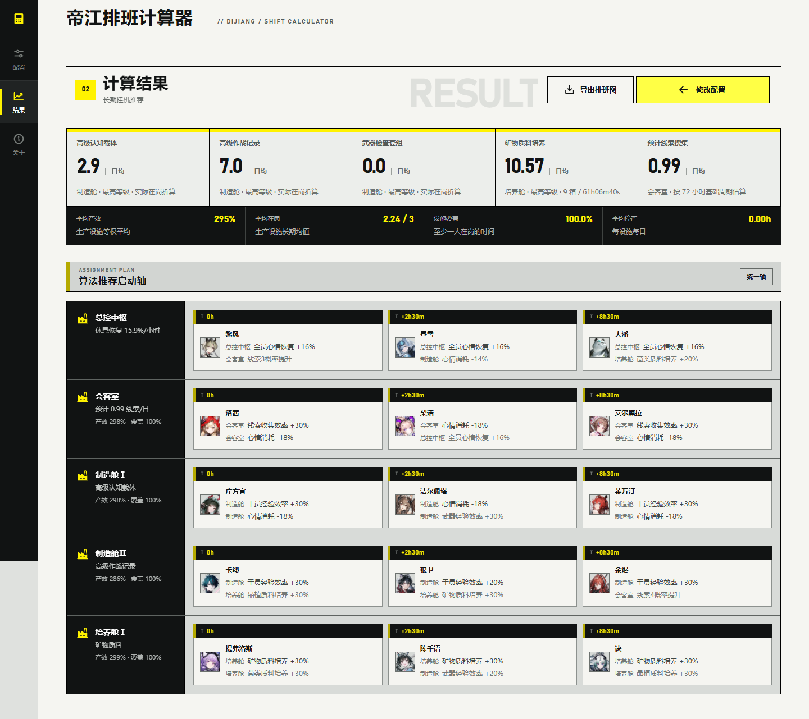

<div align="center">

# Endfield-IS

**Dijiang Infrastructure Shift Calculator for _Arknights: Endfield_**

Estimate long-run AFK or fixed-login schedules from operators, promotion levels, production recipes, and login times.

[简体中文](README.md) · [English](README.en.md)

[](https://www.endfieldis.dpdns.org/)
[](https://endfield-is.vercel.app/)
[](https://react.dev/)
[](https://vite.dev/)
[](#key-capabilities)

<kbd>AFK Solver</kbd> <kbd>Fixed Rotation</kbd> <kbd>Morale Simulation</kbd> <kbd>Production Estimate</kbd>

</div>

---

> Endfield-IS is an unofficial infrastructure calculator for the Dijiang. Operator ownership, promotion levels, production targets, and login times are entered manually; the project does not read, detect, or control the game client.

## Contents

1. [Live App](#live-app)
2. [Interface Preview](#interface-preview)
3. [Key Capabilities](#key-capabilities)
4. [Scheduling Modes](#scheduling-modes)
5. [Calculation Model](#calculation-model)
6. [Local Development and Testing](#local-development-and-testing)
7. [Deployment](#deployment)
8. [Data and Assets](#data-and-assets)

---

## Live App

| Site | Purpose | URL |
|---|---|---|
| EdgeOne Makers | Primary mainland-oriented deployment | [Open calculator](https://www.endfieldis.dpdns.org/) |
| Vercel | Overseas and fallback deployment | [Open calculator](https://endfield-is.vercel.app/) |

### Basic Workflow

1. Choose **Long-run AFK** or **Fixed-login Rotation**.
2. Set a fixed recipe for each manufacturing cabin, a growth-material category, and the scheduling parameters.
3. Select owned operators and adjust their E0–E4 promotion levels. Every operator defaults to E4, while the roster starts unselected.
4. Run the solver and review per-facility assignments, startup timing, skill activation, and estimated daily output.
5. Copy a link to the current configuration or export the calculated schedule as a branded image.

---

## Interface Preview

<div align="center">
  
  
</div>

The interface takes the official Endfield website as its primary visual reference, translating its black, fog-white, and signal-yellow language into a responsive utility UI for desktop and narrow screens.

The previews above show the current `v0.1.3` interface.

---

## Key Capabilities

- **30 assignable operators:** excludes both Administrator variants because reliable infrastructure data is unavailable; operators without matching skills remain valid universal staffing candidates.
- **Promotion-aware skills:** per-operator E0–E4 selection controls the unlock and upgrade state of up to two infrastructure skills. Both slots remain visible in results, with locked or inactive skills muted.
- **Per-cabin production targets:** Manufacturing Cabins I and II independently keep Advanced Cognitive Carrier, Advanced Battle Record, or Weapon Inspection Kit fixed; Growth Chamber I keeps mineral, vitrified-plant, or fungal material fixed.
- **Unique cross-facility allocation:** solves the Control Nexus, Reception Room, Manufacturing Cabins I and II, and Growth Chamber I together so an operator is never double-booked at the same time.
- **Continuous morale simulation:** models work drain, Control Nexus recovery, skill modifiers, automatic leave, and full-morale return. Fixed rotations never reset a reused operator to full morale.
- **Output-first optimization:** optimizes verified stable-cycle daily output and may accept short downtime when fully staffed high-efficiency periods compensate for it.
- **Non-blocking calculation:** long searches run in a Web Worker with progress shown by a bottom-edge bar.
- **Client-only sharing:** configuration is compressed into the URL hash without uploading account data, while results can be exported as community-ready schedule images.

---

## Scheduling Modes

### Long-run AFK

Simulates Dijiang's automatic duty cycle: an operator leaves at zero morale and returns after recovering to full. The solver searches real startup offsets in 30-minute steps, then compares stable-cycle daily output after a long warm-up.

| Search Scope | Description |
|---|---|
| Unified startup axis | Every facility shares one startup timeline for simpler execution |
| Per-facility startup axes | Facilities search independently and use separate axes only when verified output beats the unified baseline |

### Fixed-login Rotation

The user enters daily login times, and each node performs a full-team replacement. Morale is tracked continuously across shifts and days; operator reuse or deliberate downtime is accepted only when it improves verified long-run output.

---

## Calculation Model

| Item | Current Rule |
|---|---|
| Working morale drain | `7% per hour` |
| Control Nexus recovery | Base `12% per hour`, multiplied by active recovery-skill modifiers |
| Manufacturing / growth / reception efficiency | `(1 + 40% × active operators) × (1 + total matching skills)` |
| Universal staffing bonus | Operators without matching room skills still provide 40% each |
| Manufacturing duration | Advanced Cognitive Carrier `24:26:40`; Advanced Battle Record and Weapon Inspection Kit `09:46:40` |
| Growth target | One of mineral, vitrified-plant, or fungal material stays fixed for the whole simulation |
| Specific-clue skills | Qualitative L1/L2 tendencies only; identical effects do not stack and no fixed daily clue count is invented |

Each manufacturing cabin keeps its selected recipe fixed. Daily output is aggregated when both cabins choose the same recipe. Outside the Control Nexus, AFK teams never mix morale-consumption-reduction operators with ordinary operators, preventing duty-cycle drift.

> Results are estimates based on the current public dataset and model, not real-time game state. Operator data and calculation rules should be updated when in-game values or mechanics change.

---

## Local Development and Testing

Node.js 20 or newer is required.

```bash
npm install
npm run dev
```

Production build and tests:

```bash
npm run build
node --test tests/schedule-model.test.mjs
node --test tests/share-tools.test.mjs
npm run test:sites
```

Browser assets are written to `dist/client`. The build also creates `dist/server/index.js` and `dist/.openai/hosting.json` for Sites-compatible handoff.

Tests cover stable-cycle startup optimization, continuous morale tracking, unique cross-facility assignments, fixed material categories, per-cabin recipes and durations, same-recipe aggregation, and clue estimation.

### Technology

React 19 · Vite 6 · Phosphor Icons · Web Worker · Node.js native test runner

---

## Deployment

Both sites track the repository's `main` branch and publish automatically.

| Platform | Install Command | Build Command | Output Directory |
|---|---|---|---|
| EdgeOne Makers | `npm install` | `npm run build` | `dist/client` |
| Vercel | `npm install` | `npm run build` | `dist/client` |

Vercel routing and build settings are defined in [`vercel.json`](vercel.json).
Search and social metadata use the EdgeOne custom domain as the canonical site, while Vercel remains the fallback entry point.

---

## Data and Assets

Operator portraits are bundled as local static assets so the interface has no runtime dependency on a third-party image service. Portrait mapping was cross-checked against the public [MR-LORD-REX/endfield-builds](https://github.com/MR-LORD-REX/endfield-builds) metadata.

_Arknights: Endfield_, its characters, artwork, and related assets belong to Hypergryph / GRYPHLINE. This unofficial project claims no ownership of game assets.

Use [Issues](https://github.com/Socialist-Sister/Endfield-IS/issues) to report data corrections, algorithm problems, or interface suggestions.
