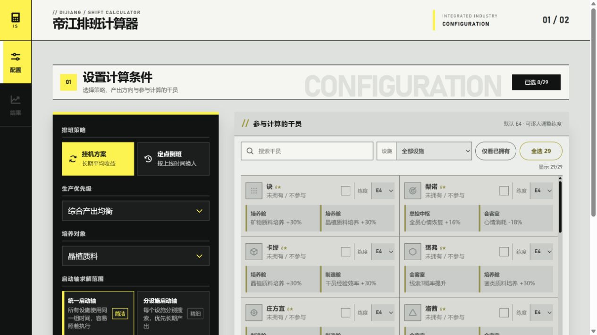
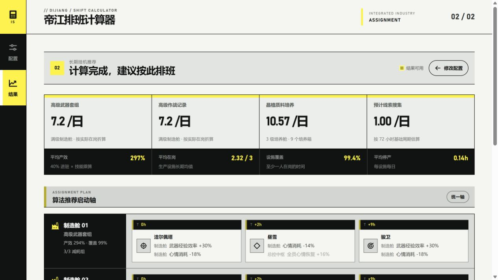

# Endfield-IS

简体中文｜[English](./README.en.md)

《明日方舟：终末地》帝江号基建排班计算器。根据玩家手动选择的干员、练度和生产目标，模拟干员技能、心情消耗、自动上下班与定点换班，给出长期排班和产量参考。

> 本项目是非官方计算工具，不会读取、识别或操作游戏客户端。干员持有情况、练度、生产目标和上线时间均由用户手动填写。

## 在线使用

[https://endfield-is.vercel.app](https://endfield-is.vercel.app)

## 界面预览





## 核心功能

- 提供 29 名可排班干员，排除暂无可靠基建数据的两种管理员形态。
- 支持逐名选择 E0–E4 练度；默认 E4，练度会控制最多两个基建技能的解锁和升级。
- 计算制造舱、培养舱、会客室和总控中枢的技能匹配、心情循环与人员分配。
- 分别报告武器经验、干员经验、选定培养材料类别和线索结果，不混合不同资源单位。
- 结果卡展示当前练度下的两个技能；本设施生效技能优先，未解锁或不生效技能保留并置灰。
- 长计算在 Web Worker 中运行，界面通过贴底进度条显示计算进度。
- 响应式适配桌面和窄屏窗口，采用黑、雾白、信号黄的终末地工业视觉语言。

## 排班模式

### 长期挂机

模拟帝江号自动上下班：干员心情耗尽后离岗，恢复至满心情后重新上岗。算法以 30 分钟为步长搜索启动偏移，并在长时间预热后比较稳定周期的实际日产量。

用户只选择搜索范围：

- **统一启动轴**：所有设施共用一组启动时间，执行更简单。
- **分设施启动轴**：各设施独立搜索，仅在验证日产量高于统一方案时采用。

满覆盖率不是硬约束。如果高人数、高技能生产阶段足以补偿停工损失，算法可以选择包含短暂停工的高产方案。

### 定点换班

用户填写每天上线时间，每个时间点执行完整班组替换。模拟会跨班次、跨天连续跟踪每名干员的心情，不会在重新使用干员时重置为满心情；只在长期实际产量更高时允许复用或停工。

## 计算口径

- 工作设施基础心情消耗：`7% / 小时`。
- 总控中枢基础恢复：`12% / 小时`，再乘算生效的恢复技能修正。
- 制造、培养和会客每个时间片的效率：`(1 + 40% × 在岗人数) × (1 + 匹配技能总和)`。
- 没有匹配设施技能的干员仍可提供通用的 40% 进驻加成。
- 制造按满级舱室和公开产品时长计算；两个制造舱生产所选优先产品，另一类经验产量记为零。
- 培养在整次模拟中固定使用矿物、晶植或菌类中的一个材料类别。
- 特定线索技能仅表示 L1 / L2 定性倾向；同类效果不叠加，也不换算为未经证实的每日固定线索数。
- 总控中枢以外的挂机设施不混用心情消耗降低干员和普通干员，避免排班乱轴。

结果是基于当前数据和模型的估算，不代表游戏内实时状态。游戏数值或规则变化后，需要同步更新数据与计算口径。

## 技术栈

React 19、Vite 6、Phosphor Icons、Web Worker、Node.js 原生测试运行器和 Vercel。

## 本地开发

需要 Node.js 20 或更高版本。

```bash
npm install
npm run dev
```

构建生产版本：

```bash
npm run build
```

浏览器资源输出到 `dist/client`；构建脚本同时生成 Sites 交付所需的 `dist/server/index.js` 和 `dist/.openai/hosting.json`。

## 测试

```bash
node --test tests/schedule-model.test.mjs
npm run test:sites
```

测试覆盖稳定周期启动轴、连续心情跟踪、跨设施唯一分配、固定材料类别、生产优先级和线索估算等关键行为。

## 部署

Vercel 已连接本仓库。推送到 `main` 会自动构建并发布生产版本；构建命令和输出目录见 [`vercel.json`](./vercel.json)。
